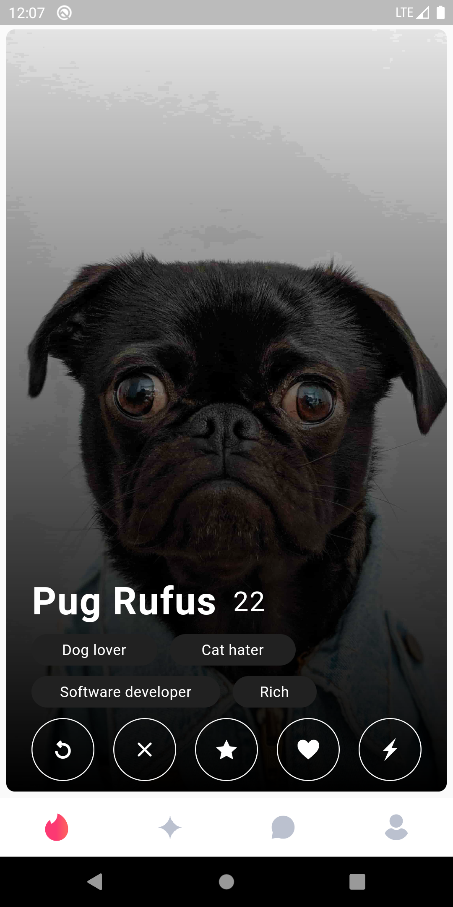
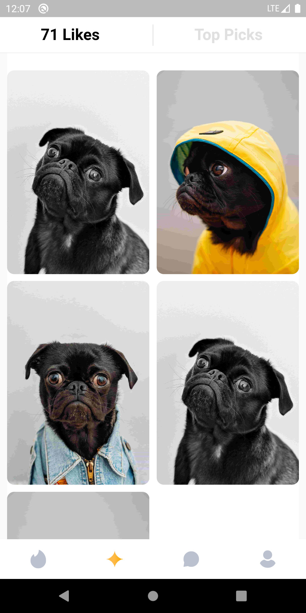

# Tinder App Clone
 User Interface of Tinder in Flutter.
 
### Languages & tools :
[][android]
[][dart]
[][flutter]
  

|Tinder Home| Tinder page2|
|------|-------|
|||

### Directory Structure :
    |-- tinder_app
    |    |-- android
    |    |-- Assets
    |    |   |-- Icons
    |    |   |   |-- account.svg
    |    |   |   |-- active_account.svg
    |    |   |   |-- active_chat.svg
    |    |   |   |-- active_hot.svg
    |    |   |   |-- active_likes.svg
    |    |   |   |-- chat.svg
    |    |   |   |-- close.svg
    |    |   |   |-- hot.svg
    |    |   |   |-- lightinig.svg
    |    |   |   |-- like.svg
    |    |   |   |-- likes.svg
    |    |   |   |-- refresh.svg
    |    |   |   |-- star.svg
    |    |   |
    |    |   |--Images
    |    |       |-- pro1.jpeg
    |    |       |-- pro2.jpeg
    |    |       |-- pro3.jpeg
    |    |
    |    |-- ios
    |    |
    |    |-- lib
    |    |   |-- screens
    |    |   |   |-- frame.dart
    |    |   |   |-- hot_page.dart
    |    |   |   |-- matched_page.dart
    |    |   |   |-- profile_page.dart
    |    |   |
    |    |   |-- export.dart
    |    |   |-- main.dart
    |    |
    |    |-- pubspec.lock
    |    |-- pubspec.yaml
    |    |-- README.md
    |
    |-- Img
    |    |-- androidstudio.png
    |    |-- dart.png
    |    |-- flutter.png
    |    |-- tinderClone1.png
    |    |-- tinderClone2.png

### Connect with me :  

  
 

[website]: https://abhilashtuofficial.github.io/
[dart]: https://github.com/AbhilashTUofficial/CloneApps
[flutter]: https://github.com/AbhilashTUofficial/CloneApps
[android]: https://github.com/AbhilashTUofficial/CloneApps
